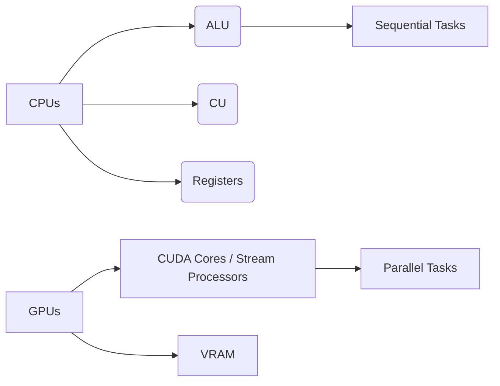
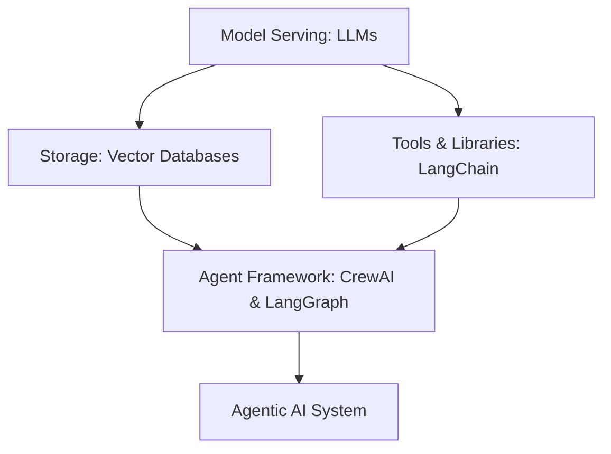
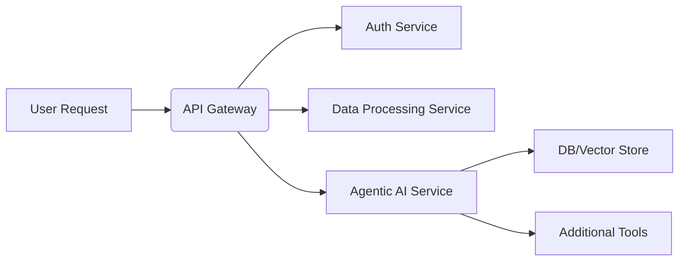

## ✨ PIAIC Lecture 4: Sunday Session Recap by Warda Rehman

Welcome to the **fourth class of PIAIC (Presidential Initiative for Artificial Intelligence and Computing)**, held at **Sindh Boy Scouts Association**. In today's lecture, we will dive deep into **Agentic AI, GPUs, Neural Networks, Microservices, and AI frameworks** like **LangChain and LangGraph**. These concepts are crucial in the modern AI ecosystem, enabling powerful AI models to operate efficiently and autonomously.

In today's lecture we will review essential topics such as **parallel computing with NVIDIA CUDA, the fundamentals of neural networks, the path toward Artificial General Intelligence (AGI), and the role of microservices in AI architecture**. By the end of this session, you will have a comprehensive understanding of how AI agents function and the infrastructure that powers them.

---

## 1️⃣ Introduction to Agentic AI & Class Overview

### What is **Agentic AI**? 
Agentic AI refers to **autonomous AI systems** that can make decisions, take actions, and interact with external tools or APIs without human intervention. These AI agents leverage **Large Language Models (LLMs)**, **machine learning models**, and **knowledge graphs** to solve complex tasks.

🔗 **Reference Repo:** [Learn-Agentic-AI](https://github.com/panaversity/learn-agentic-ai/tree/main/01_technology_background/01_what_is_a_gpu)

### Demonstration: "Hello World" with Google Gemini
In this session, we ran a basic "Hello World" example using **Google Gemini 2.0 Live API**, demonstrating how LLMs can process and respond to queries in real time.

---

## 2️⃣ CPUs vs. GPUs: Understanding the Difference 

### **2.1 CPU (Central Processing Unit)** 
- **Sequential Processing**: Executes one instruction at a time.
- **Components:**
  - **ALU (Arithmetic Logic Unit)** – Handles calculations and logical operations.
  - **Control Unit (CU)** – Directs the flow of instructions.
  - **Registers** – Small storage units for temporary data.

### **2.2 GPU (Graphics Processing Unit)** 
- **Parallel Processing**: Executes multiple tasks simultaneously, making it ideal for AI workloads.
- **Key Features:**
  - **CUDA Cores (NVIDIA) / Stream Processors (AMD)** – Execute computations in parallel.
  - **VRAM (Video RAM)** – Stores high-speed data for AI processing.
- **Why GPUs for AI?**
  - **Scalability**: GPUs enable fast training and execution of neural networks.



📌 **Further Reading:** [What is a GPU?](https://github.com/panaversity/learn-agentic-ai/tree/main/01_technology_background/01_what_is_a_gpu)

---

## 3️⃣ NVIDIA CUDA: Parallel Computing and AI Acceleration 

### **What is CUDA?**
CUDA (Compute Unified Device Architecture) is a parallel computing platform developed by **NVIDIA** that allows **GPUs to perform general-purpose computing tasks** beyond graphics processing.

### **Key Features of CUDA:**
- **Parallel Processing**: Tasks are divided into thousands of threads running simultaneously.
- **AI Optimization**: Libraries like **cuBLAS, cuDNN, and TensorRT** enhance deep learning performance.

🔗 **Further Reading:** [NVIDIA CUDA Overview](https://developer.nvidia.com/cuda-zone)

---

## 4️⃣ Fundamentals of Neural Networks 

Neural networks use the following equation to process data:

\[ y = w x + b \]

- **(x)** → Input Data
- **(w)** → Weights (Model Parameters)
- **(b)** → Bias
- **(y)** → Output Prediction

By stacking multiple layers, **deep learning models** can make complex decisions based on data patterns.

📌 **Further Reading:** [Neural Networks Explained](https://www.tensorflow.org/tutorials/)

---

## 5️⃣ The Road to Artificial General Intelligence (AGI) 

| **Step**        | **Description**                              |
|---------------|--------------------------------|
| **Chatbots**  | Basic Q&A systems powered by LLMs.  |
| **Reasoners** | AI models that perform logical reasoning. |
| **Agents**    | AI that interacts with tools and APIs. |
| **Innovators** | AI capable of **creating new ideas**. |
| **Organizations** | AI-run institutions with minimal human involvement. |

📌 **Further Reading:** [The Future of AGI](https://openai.com/research/)

---

## 6️⃣ Compound AI Systems: Why Use Multiple Models? 

Instead of relying on a **single model**, compound AI systems combine multiple specialized models, ensuring:
- **Better Accuracy**
- **More Flexibility**
- **Faster Response Time**

---

## 7️⃣ Agentic AI Stack Overview 

The **Agentic AI Stack** is the backbone of AI-powered applications, comprising multiple layers that work together to ensure efficient performance. Below is an overview of the essential layers and their roles:

| **Layer**           | **Function**                                         | **Examples**                        |
|--------------------|--------------------------------------------------|----------------------------------|
| **Model Serving**  | LLMs process and generate text (core AI "brain"). | OpenAI, Anthropic               |
| **Storage**       | Stores and retrieves conversation history and embeddings. | Chroma, Weaviate, Pinecone       |
| **Tools & Libraries** | Extends AI capabilities beyond text (e.g., code execution, web access). | LangChain, custom APIs            |
| **Agent Frameworks** | Orchestrates multi-step tasks, manages state, and coordinates interactions. | CrewAI, LangGraph                 |

### **Agentic AI Frameworks: CrewAI & LangGraph**
Two powerful frameworks streamline the management and execution of **AI-driven agents**:

- **CrewAI**: Facilitates the coordination of multiple agents with specialized roles.
- **LangGraph**: A graph-based approach that manages state, context, and workflow efficiently.



📌 **Further Reading:** [Agentic AI Stack Overview](https://github.com/panaversity/learn-agentic-ai/tree/main/01_technology_background/01_what_is_a_gpu)

---
## 8️⃣ The Next Wave of AI: Humanoids, Cloud, Edge & Link Computing 

The next phase of AI development will integrate **robotics, cloud computing, and edge intelligence** to create more advanced autonomous systems. Below are some key technological advancements in this area:

### 1️⃣ **Humanoid Robotics**
- AI combined with robotics to create **human-like** machines capable of performing complex tasks.
- Examples include **AI-powered robots** used in customer service, healthcare, and industrial automation.

### 2️⃣ **Cloud Computing** 
- Heavy AI computations are **offloaded to remote servers** (AWS, Azure, GCP) instead of running locally.
- This approach allows scalability and access to **high-performance AI models** from anywhere.

### 3️⃣ **Edge Computing**
- **Processes data on local devices** (IoT devices, smartphones) instead of relying on cloud servers.
- Example: **Self-driving cars** perform real-time AI inference on-board instead of sending data to the cloud.

### 4️⃣ **Link Computing** 
- A distributed approach connecting **cloud, edge, and local computing resources** to maximize efficiency.
- Ensures **seamless AI-powered applications** that can dynamically switch between local and cloud-based processing.

📌 **Further Reading:** [Cloud & Edge Computing](https://www.ibm.com/cloud/what-is-edge-computing)

---


## 9️⃣ Microservices & AI Architecture 

| **Architecture** | **Pros** | **Cons** |
|-----------------|---------|----------|
| **Monolithic**  | Simple structure | Hard to scale |
| **Microservices** | Scalable and flexible | More complex setup |



📌 **Further Reading:** [Microservices in AI](https://aws.amazon.com/microservices/)

---

## 🔟 LangChain & LangGraph: AI-Orchestrating Frameworks 

LangChain and LangGraph help AI models **manage context, interact with APIs, and automate workflows**.

```python
!pip install -Uq langchain langchain-google-genai

from langchain_google_genai import ChatGoogleGenerativeAI

# Initializing Google Gemini model
llm = ChatGoogleGenerativeAI(model="gemini-2.0-flash-exp", api_key="YOUR_API_KEY")

# Testing Hello World
response = llm("Hello, world!")
print(response)
```
## Hello World with LangChain
```python
!pip install -Uq langchain langchain-google-genai

from langchain_google_genai import ChatGoogleGenerativeAI
from google.colab import userdata

# Retrieving API Key securely
GOOGLE_API_KEY = userdata.get('GOOGLE_API_KEY')

# Initializing the Gemini 2.0 model
llm: ChatGoogleGenerativeAI = ChatGoogleGenerativeAI(
    model="gemini-2.0-flash-exp",
    api_key=GOOGLE_API_KEY,
)

# Simple Hello World Prompt
response = llm("Hello, world!")
print(response)
```

📌 **Further Reading:** [LangChain Docs](https://python.langchain.com/)

---
## Wrap-Up

This session provided insights into **Agentic AI**, including its **core infrastructure, Model Serving, Storage, and AI frameworks** such as LangChain and CrewAI. We explored the **superiority of GPUs over CPUs** in AI processing, the role of **NVIDIA CUDA in parallel computing**, and **neural networks' fundamental principles**.

The **AGI roadmap** illustrated the progression from **chatbots to fully autonomous AI systems**. We discussed **emerging AI trends** like **humanoid robots, cloud, edge, and link computing**, along with the importance of **microservices in scalable AI architectures**. Lastly, we examined **LangChain and LangGraph** as key tools for AI **workflow automation and orchestration**.

 **🚀Master AI, innovate the future! 🌟**

