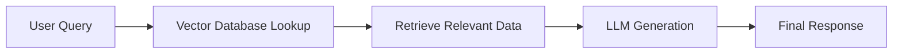

## ✨ PIAIC Lecture 5: Sunday Session Recap by Warda Rehman

Welcome to the **fifth class of PIAIC (Presidential Initiative for Artificial Intelligence and Computing)**, held at **Sindh Boy Scouts Association**. This session will introduce **advanced AI concepts** such as **Retrieval-Augmented Generation (RAG), Vector Databases, Face Detection, and Large Language Model (LLM) leaderboards**.

The session today will cover essential topics, including **how RAG enhances AI-generated responses, the role of vector databases in improving search relevance, tokenization in NLP, autoencoders for data compression, and the practical implementation of AI-powered face detection**.

---

## 1️⃣ LLM Leaderboards & Model Rankings 

### **What is an LLM Leaderboard?**
A **Large Language Model (LLM) leaderboard** is a ranking system that evaluates and compares different AI models based on performance in various tasks, such as:
- **Question Answering**
- **Summarization**
- **Text Generation**
- **Code Generation**

### **Why Are Leaderboards Important?**
- Help **researchers and developers** choose the most effective models for their tasks.
- Provide **benchmark comparisons** across different models.
- Keep track of the latest **advancements in AI**.

📌 **Further Reading:** [Hugging Face LLM Leaderboard](https://huggingface.co/spaces/HuggingFaceH4/open_llm_leaderboard)

---

## 2️⃣ Retrieval-Augmented Generation (RAG) 

### **What is RAG?**
RAG is an AI framework that **enhances AI-generated responses** by retrieving relevant information from an external database **before generating an answer**.

### **How RAG Works:**
1️⃣ **User Query** → The system receives a question or request.  
2️⃣ **Vector Database Lookup** → The query is converted into an embedding (vector) and matched with stored information.  
3️⃣ **Retrieval** → The system retrieves the most relevant documents from the database.  
4️⃣ **LLM Generation** → The retrieved documents and the original query are passed to an LLM, which generates a more **accurate and context-aware response**.  



---

## 3️⃣ Vector Databases (e.g., Pinecone) 

### **What is a Vector Database?**
A **vector database** stores and retrieves **high-dimensional vector embeddings**, which represent text, images, or other data in numerical form.

### **Why Use Vector Databases?**
- **Faster and More Relevant Search Results**
- **Improved Context Understanding in AI Models**
- **Optimized for Large-Scale Data Handling**

📌 **Further Reading:** [Pinecone Vector Database](https://www.pinecone.io/)

---

## 4️⃣ Tokenization & Word Embeddings 

### **What is Tokenization?**
Tokenization is the process of **breaking down text** into smaller units called **tokens**, which can be:
- **Words** (e.g., "AI is powerful" → `["AI", "is", "powerful"]`)
- **Subwords** (e.g., "running" → `["run", "ning"]`)
- **Characters** (e.g., "AI" → `["A", "I"]`)

📌 **Further Reading:** [Tokenization in NLP](https://www.geeksforgeeks.org/nlp-how-tokenizing-text-sentence-words-works/)

---

## 5️⃣ Autoencoders 

An **autoencoder** is a type of **neural network** used for **compressing and reconstructing data**.

### **How Autoencoders Work:**
1️⃣ **Encoder** → Compresses the input data into a smaller representation.  
2️⃣ **Decoder** → Reconstructs the original data from the compressed version.  

📌 **Further Reading:** [Autoencoders Explained](https://towardsdatascience.com/autoencoders)

---

## 6️⃣ Different Systems in RAG 

RAG integrates several AI techniques to enhance response accuracy:
- **Retrieval & Document Search**: Fetch relevant documents to enhance generated answers.
- **Semantic Similarity Matching**: Focus on finding the most meaningfully similar pieces of text.
- **Classification & Clustering**: Categorize content (e.g., spam vs. not spam). Group similar items or documents based on their embeddings.

---

## 7️⃣ Face Detection and Embedding Practical (LangChain, RAG, Google Gemini) 🤖

## RAG Flow for Face Tasks
- **Face Embedding**: Convert faces to vector form.
- **Storage**: Put these embeddings into a vector database.
- **Query**: On a new image, generate its embedding and compare with existing ones.
- **Augment**: Use RAG to retrieve any extra info from the database, then pass it to an LLM to generate richer answers.

### **Code Example: Face Detection & Embedding**
```python
import cv2
import face_recognition
import numpy as np

# Load an image
image = face_recognition.load_image_file("person1.jpg")
face_locations = face_recognition.face_locations(image)
face_embeddings = face_recognition.face_encodings(image, face_locations)

# Print out embeddings
for i, embedding in enumerate(face_embeddings):
    print(f"Face {i+1} Embedding Vector: {embedding}")
```

## Integrating LangChain, RAG, and Google Gemini
- **LangChain**: Helps build a “chain” that retrieves embeddings from a vector DB, then uses an LLM to analyze or answer.
- **RAG**: The system retrieves relevant embeddings/info and feeds them to the model for context.
- **Google Gemini**: Google’s advanced upcoming LLM—can be integrated similarly to GPT, sending queries and receiving generated text.

📌 **Further Reading:** [Face Recognition Library](https://github.com/ageitgey/face_recognition)

---

## 8️⃣ LangChain, RAG, and Google Gemini Integration 

LangChain and RAG **help integrate LLMs with external databases**, enabling **context-aware responses**.

- **Distance Metrics**: Cosine similarity, Euclidean distance, etc., measure how “close” embeddings are.
- **Indexing**: Vector databases often create special indexes (like ANN indexes) to speed up searches.
- **Prompt Engineering**: Crafting the right prompt so the LLM effectively uses retrieved info.
- **Fine-tuning vs. In-context Learning**: With RAG, you often don’t need to fully re-train your model; you just provide extra context at runtime.

📌 **Further Reading:** [LangChain Documentation](https://python.langchain.com/)

---

## **Wrap-Up**

This session explored **RAG, vector databases, tokenization, autoencoders, and AI-powered face detection**. We learned how **RAG enhances AI models**, the importance of **vector embeddings**, and the practical implementation of **face recognition using AI**. Additionally, we discussed how **LangChain, RAG, and Google Gemini** can work together to improve AI interactions.

**🚀AI is the future—equip yourself with knowledge and build smarter solutions!**

